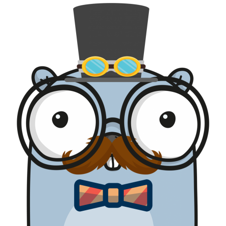
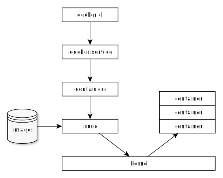
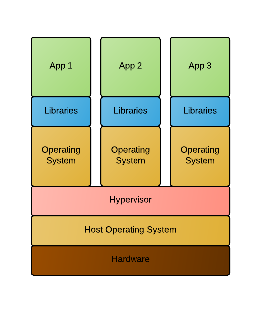
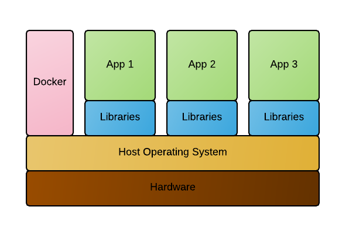
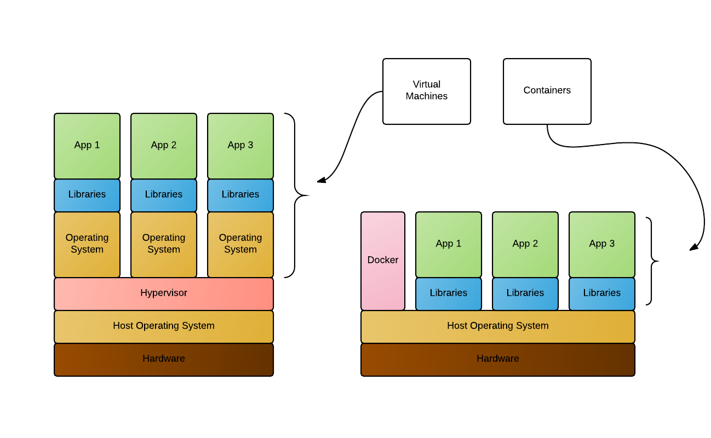
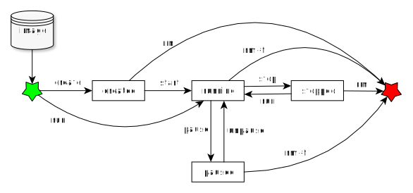

---
revealOptions:
  transition: fade

---

# Container mit Podman

<div id="header-footer">
  <p class="slide-footer"><br>tarent solutions GmbH<br>Volker Schmitz & Daniel Zerlett</p>
</div>

----

<div class="divided">
  <h4>Volker Schmitz</h4>
  
  <h5>DevOps Engineer</h5>
  v.schmitz@tarent.de
</div>

<div class="divided">
  <h4>Daniel Zerlett</h4>
  
  <h5>Software Architect</h5>
  d.zerlett@tarent.de
</div>

Note:
Wer seid Ihr/Vorstellungsrunde
Regeln:

- Du
- Fragen direkt mit aufzeigen
  - kein reinreden
- Diskusionen erwünscht

----

## Themen

- Überblick
- Docker CLI
- Container-Lifecycle
- Portfreigaben
- Volumes
- Environment-Variablen
- Eigene Images erstellen

---

# Überblick

- Was ist Docker?
- Containerarchitektur
- Container vs. Virtualisierung

----

## Was ist Docker?

"Docker ist eine freie Software zur Isolierung von Anwendungen mit Containervirtualisierung."<br>--*Wikipedia*

- vereinfacht die Bereitstellung von Anwendungen
- gewährleistet die Trennung von Ressourcen
- ermöglicht Isolation von Anwendungen und deren Abhängigkeiten
- basiert auf Linux-Techniken wie cgroups und Namespaces

Notes: - Erscheinungsjahr: 2013
Probleme ohne Docker:
- Abhängigkeiten
- Skalierung
- Versionierung/Rollback
- Rückstände

----

## Architekturüberblick



Note:
- Container Runtime
  - Containerd
- OCI (Open Container Initiative)
- Docker, Kubernetes, Podman, Docker-Compose
- MacOS Windows ist container kram anders

----

## Hardwarevirtualisierung (VM)



----

## Containerisierung



----

## Container vs. Virtualisierung



Note:
- Allgemein
  - Container nutzen den selben Kernel
- Virtualisierung
  - Virtuelle Resourcen
  - pro VM zusätzlicher Kernel
- Container
  - Taskrunner (ähnlich systemd/init)
  - Isolieren von Prozessen und deren Abhängigkeiten
    - eigenes Dateisystem
  - Plattformabhängig (i386/arm etc.)
- Beispiel
  - Glusterfs

---

# Einblick in die CLI

- Einführung in Docker CLI
- Grundlagen der Containerverwaltung

----

## hello-world

```bash
podman run hello-world
```

<iframe src="http://localhost:4200?u=trainer&p=trainer"> <!-- .element: class="fragment" -->

Note:
Erster Gehversuch mit Podman, Podman Umgebung funktioniert.
`podma run [options] IMAGE [COMMAND] [ARG...] [flags]`

----

## Podman CLI

Podman CLI ist ein Kommandozeilen-Tool mit dem sich der Docker-Daemon kontrollieren lässt.

Einfache Anwendungsfälle von Docker CLI:
- Container erstellen
- Container starten
- Container anzeigen
- Container stoppen

Note:
Ziel: Podman CLI Grundlagen verstehen
Systemd-Analogie ansprechen

----

## Podman CLI

```shell
podman run -p 8080:80 wordpress
podman run -d -p 8080:80 wordpress
podman ps
podman logs <containerID>
```

<iframe width="100%" src="http://localhost:4200?u=trainer&p=trainer"> <!-- .element: class="fragment" -->

[Wordpress](http://localhost:8080)

Note:
https://hub.docker.com/_/wordpress/
Ziel ist es zu erkennen, wie einfach die Instalation ist.

----

## Übung gitea

- Starte "gitea" vom Image "gitea/gitea" im Hintergund
- Exponiere den Container-Port 3000 auf den Host-Port 3000
- Zeige alle laufenden Docker-Prozesse an
- Erkenne, ob der Port 3000 auf Port 3000 exponiert ist
- Betrachte die Log-Ausgabe des gitea-Containers in Echtzeit

Note:
Bonus bonus: Gibt es noch andere Ports im gitea-Container, die nicht exponiert sind? Wenn ja, exponiere auch diesen Port!

----

## Übung gitea

```shell
podman run -d -p 3000:3000 gitea/gitea
podman ps
podman logs <containerID>
```

<iframe width="100%" src="http://localhost:4200?u=trainer&p=trainer"> <!-- .element: class="fragment" -->

Note:
```shell
podman logs -f <containerID>
```
----

## Zusammenfassung

- Erstellen eines Containers mit exponiertem Port
  - `podman run`
- Containerübersicht
  - `podman ps`
- Ausgabe von Logs
  - `podman logs`
- Docker CLI Hilfe
  - `podman help`
  - `podman help <subcommand>`

---

# Container-Lifecycle

- Überblick der Containerzustände
- Wechseln zwischen Containerzuständen
- Restart-Policies

----

## Container-Lifecycle



Note:
podman ps -a
podman stop
podman rm

----

## Übung Lifecycle

- Alle laufenden Container sollen beendet und gelöscht werden.
- Wie stelle ich fest, dass alle Container gelöscht sind?

<iframe width="100%" src="http://localhost:4200?u=trainer&p=trainer"> <!-- .element: class="fragment" -->

----

## Restart Policies

- no
- always
- on-failure
- unless-stopped

```shell
  podman run --restart=always alpine /bin/false
```

<iframe class=small width="100%" src="http://localhost:4200?u=trainer&p=trainer"> <!-- .element: class="fragment" -->

----

## Zusammenfassung


Note:

- Podman Status übersicht und Lifecycle
  - Created
    - Container ist erstellt aber nicht gestartet
  - Running
    - Container ist gestartet
  - Stopped
    - Container ist noch vorhanden aber gestoppt
  - Paused
    - Container ist angehalten
  - Deleted
    - Container ist gelöscht

---

# Ports & Volumes

- Einblick in Portfreigaben
- Einblick in Volumes
  - Typen
  - Berechtigungen

----

## Einblick Portfreigaben

Podman kann Container Ports an Hostports binden (exponieren).

```shell
podman run -d -p 8081:80 wordpress
podman run -d -p 80 wordpress
podman run -d -p 8082:80 -p 8443:443 wordpress
podman ps
```

<iframe width="100%" src="http://localhost:4200?u=trainer&p=trainer"> <!-- .element: class="fragment" -->

Note:
Zwei unterschiedliche Container, binden auf zwei unterschiedlichen Ports.
Random-Ports erklären
Multiple Ports für einen Conainer
Port Ranges 8000-9000:8000:9000

----

## Einblick Volumes

Docker kann Containerverzeichnisse mit lokalen Verzeichnissen verbinden ("volume mount").

- Volumetypen
  - anonymous
    - `podman run -v /path/in/container ...`
  - named
    - `podman volume create somevolumename`
    - `podman run -v name:/path/in/container ...`
  - host
    - `podman run -v /path/on/host:/path/in/container ...`

----

## Demo Host-Volume

```shell
podman run -v /root/examples/nginx/:/usr/share/nginx/html:ro -d nginx
```

<iframe width="100%" src="http://localhost:4200?u=trainer&p=trainer"> <!-- .element: class="fragment" -->

----

### Podman Volumes Detail

- Jedes lokale Verzeichnis kann in Container gemounted werden
  - Lesen von Configs <!-- .element: class="fragment" -->
  - Generierten output vom Container persistieren <!-- .element: class="fragment" -->
- Standard: read/write (rw) <!-- .element: class="fragment" -->
  - podman run -v /local/folder:/container/folder imageName <!-- .element: class="fragment" -->
  - podman run -v /local/folder:/container/folder:rw imageName <!-- .element: class="fragment" -->
- Read only (ro) <!-- .element: class="fragment" -->
  - podman run -v /local/folder:/container/folder:ro imageName <!-- .element: class="fragment" -->

----

## Übung Volumes & Ports

- Starte gitea mit folgenden Optionen:
  - Persistenz der Git-Konfiguration (Container-Pfad /data)
  - Exponiere das Webinterface
    - Containerport 3000 auf lokalen Port 3000
  - Exponiere SSH
    - Containerport 22 auf lokalen Port 3022
- Richte gitea über das Webinterface ein (http://localhost:3000)
  - Default-Settings lassen
- Container stoppen und löschen
  - Bonus: Gibt es einen Befehl der Stoppen und Löschen vereint?
- Container mit den selben Optionen wieder erstellen
- Was passiert mit der Konfiguration und den Nutzdaten von gitea?

----

## Übung Volumes & Ports

<iframe width="100%" src="http://localhost:4200?u=trainer&p=trainer"> <!-- .element: class="fragment" -->

Note:
podman run -v /root/examples/gitea/data:/data -p 3000:3000 -p 22:3022 -d gitea/gitea
podman stop `containterid`
podman rm `containerid`
podman rm -f `containerid`

----

## Zusammenfassung

- Exponieren von beliebigen Ports
  - Random Ports
  - Fixed Ports
  - Port Ranges
- Einbinden von Volumes
  - Volumetypen
  - Schreibberechtigung (ro/rw)
- Stoppen und löschen von Containern
  - podman stop
  - podman rm [-f]

Note:
podman run -p 3000:3000 -p 3022:22 -v $(pwd)/giteatest:/data gitea/gitea

---

# Umgebungsvariablen

- Benutzen von Umgebungsvariablen
- Funktion von Umgebungsvariablen

----

## Einblick Umgebungsvariablen

```shell
podman run -d \
           -e MYSQL_ROOT_PASSWORD=supersicher \
           -e MYSQL_USER=wordpress \
           -e MYSQL_PASSWORD=wordpress \
           -e MYSQL_DATABASE=wordpress \
           -v $(pwd)/mariadb-data:/var/lib/mysql \
           --name wordpress-database \
           mariadb

podman inspect wordpress-database
```

Note:
Beispiel environment Variablen an MariaDB zeigen.

----

## Übung PostgresDB starten

- Starte einen [postgreSQL](https://hub.docker.com/_/postgres/) Container mit:
  - einer automatisch erstellten Datenbank mit dediziertem Benutzeraccount
  - Umgebungsvariablen
    - POSTGRES_USER, POSTGRES_PASSWORD, POSTGRES_DB
- Sorge dafür, dass das Datenverzeichnis lokal gemapped ist.
  - /var/lib/postgresql/data auf ein lokales - $(pwd)/volumes/db

<iframe class=small width="100%" src="http://localhost:4200?u=trainer&p=trainer"> <!-- .element: class="fragment" -->

Note:
podman run -d \
--name=gitea-database \
-e POSTGRES_USER=gitea \
-e POSTGRES_PASSWORD=gitea \
-e POSTGRES_DB=gitea \
-v $(pwd)/postgresql-data:/var/lib/postgresql/data \
postgres

----

## Zusammenfassung

- Containernamen
  - `podman run --name ...`
- Environment-Variablen an Container übergeben (-e)
- `podman inspect`

---

# Kommunikation zwischen Containern

- Netzwerkzugriff zwischen Containern
- Docker DNS

----

## Pods
Container verknüpfen

```shell
podman pod create -n mypod -p 80:8080
podman run -d --name wordpress-database
           -e MYSQL_ROOT_PASSWORD=supersicher \
           -v /root/examples/mariadb/data:/var/lib/mysql \
           --pod mypod
           mariadb
podman run -d --pod mypod wordpress
```

<iframe width="100%" src="http://localhost:4200?u=trainer&p=trainer"> <!-- .element: class="fragment" -->

Note:
/examples/wordpress.sh benutzen!
Nicht der beste Weg, nur zur Demonstration
Wordpress-Container starten, mit mysql verknüpfen
Ziel: Interne Kommunikation zwischen Containern
podman run --link=wordpress-database -e WORDPRESS_DB_HOST=wordpress-database -e WORDPRESS_DB_USER=wordpress -e WORDPRESS_DB_PASSWORD=wordpress -e WORDPRESS_DB_NAME=wordpress wordpress

----

## Übung: Gitea mit PostgreSQL

- Stoppe deinen Gitea-Container
- Leere das Gitea-Datenverzeichnis (Volume)
- Starte deinen Gitea-Container
- Gitea soll seine Konfiguration in einer PostgreSQL speichern
- Benutze dafür die zuvor erstellte Datenbank

<iframe class="small" src="http://localhost:4200?u=trainer&p=trainer"> <!-- .element: class="fragment" -->

Note:
podman run -d --name=gitea-database -e POSTGRES_USER=gitea -e POSTGRES_PASSWORD=gitea -e POSTGRES_DB=gitea -v /root/examples/gitea/psql/data:/var/lib/postgresql/data postgres
podman run -d -p 3000:3000 -v /root/examples/gitea/data:/data -p 3000:3000 -p 3022:22 --link=gitea-database gitea/gitea

----

## Kommunikation über Sockets

```bash
podman run -d -p 9000:9000 \
  -v "/var/run/docker.sock:/var/run/docker.sock" \
  portainer/portainer
```

<iframe src="http://localhost:4200?u=trainer&p=trainer"> <!-- .element: class="fragment" -->

----

## Zusammenfassung

Verbinden von Containern

- --link
- Namensauflösung per Docker DNS
- Kommunikation mit Sockets

---

# Container und Images

- Begriffsklärung
- Unterschiede

----

## Definition Container / Images

Ein Container ist die aktive Instanz aus einem Image und kann zur Laufzeit verändert werden.
Ein Image ist nicht **lauffähig** und es ist ein *"Speicherabbild"* eines Containers.


Ein Image besteht aus mehreren unveränderlichen Layern.
Ein Image kann verändert werden indem ein oder mehrere Layer hinzugefügt werden.

----

## Container und Images

```shell
podman run -it ubuntu bash
  >> apt-get update
  >> apt-get install -y git
  >> exit
podman run -it ubuntu git --version
podman commit <containerid>
```

<iframe width="100%" src="http://localhost:4200?u=trainer&p=trainer"> <!-- .element: class="fragment" -->

Note:
Was ist ein Image und was ist ein Container
Beispiel: git commit

- podman run -it ubuntu -> apt-get update; apt-get install git -y; exit
- podman run -it ubuntu git --version

Das Selbe nochmal mit commit

- podman image ls

----

## Zusammenfassung

- Unterschied Container und Images
- `podman commit`
  - Erstellen eines Images aus einem Container
- `podman images`
  - Anzeigen von Images

---

# Docker Hub & Registry

- `podman pull`
- Docker Hub
- Tags und Versionierung

Note:

- podman pull
  - Dient zum herunterladen von Images
  - Default regirsty ist docker Hub
  - Tags dienen zur Versionierung
  - Tags dienen auch zur identifizierung der Container Registry
    - default docker hub

----

## Podman Tags

```bash
podman pull nginx
podman pull nginx:latest
podman pull nginx:alpine
podman images
```

<iframe width="100%" src="http://localhost:4200?u=trainer&p=trainer"> <!-- .element: class="fragment" -->

Note:
Wie lade ich Images herunter?

----

## Docker Hub

https://hub.docker.com/
<br>
https://hub.docker.com/_/nginx

Notes:
Öffentliche, offizielle Docker-Registry
Kostenloser Account
Alle tags sichtbar
Doku zu Images
Containerfiles können (meist) eingesehen werden (link zu Github)

----

## Docker Registry

- Eigene Registry erstellen
  - https://hub.docker.com/_/registry
- Docker Tag verweist auf die Registry
- `docker push`

<iframe width="100%" src="http://localhost:4200?u=trainer&p=trainer"> <!-- .element: class="fragment" -->

Note:

- Pullen eines containers
- podman run -d -p 5000:5000 --restart always registry:2
- podman pull nginx
- podman tag nginx localhost:5000/nginx
- podman push localhost:5000/nginx

----

## Zusammenfassung

- [hub.docker.cok](https://hub.docker.com)
- Eigene Registries
  - pushen in nicht standard *registry*
- Versionierung über Tags

---

# Images erstellen

- Image mit dem CLI erstellen
- Image aus Dockerfile erstellen
- Tags und Versionierung

----

## Image mit dem CLI erstellen

Beispiel: nginx mit eigener index.html

```bash
# bash im nginx Container starten
podman run --name mynginx-container -d -p 8089:80 nginx
podman exec -it mynginx-container bash
# im Container
echo "<h1>Hello World</h1>" > /usr/share/nginx/html/index.html
exit

# Neues Image mit Änderungen erstellen
podman commit mynginx-container mynginx-image
```

<iframe class=small width="100%" src="http://localhost:4200?u=trainer&p=trainer"> <!-- .element: class="fragment" -->

Note:
Container commit erklären mit Überleitung zu Dockerfile

----

## Image aus Dockerfile erstellen

```shell
# Containerfile
FROM nginx
RUN echo "<h1>Hello World from Dockerfile</h1>" > \
    /usr/share/nginx/html/index.html
```

```bash
# Image bauen
podman build -t mynginx-image:2 .
# Container aus Image (mit CLI erstellt) starten
podman run -d -p 8081:80 mynginx-image
# Container aus Image (mit Dockerfile erstellt) starten
podman run -d -p 8082:80 mynginx-image:2
```

<iframe class=small width="100%" src="http://localhost:4200?u=trainer&p=trainer"> <!-- .element: class="fragment" -->

----

## Übung

- Baue ein Docker-Image mit tag mynginx, das auf nginx basiert
- Baue einen zweiten nginx container der den "COPY"-Befehl nutzt.
- Tagge den Container als mynginx in Version 2
- Bonus: Nutze Nginx mit alpine anstatt ubuntu
- Bonus: Vergleiche die Imagegrößen

https://hub.docker.com/_/nginx

<iframe class=small width="100%" src="http://localhost:4200?u=trainer&p=trainer"> <!-- .element: class="fragment" -->

Note:
https://en.wikipedia.org/wiki/Tantrum

----

## Container Base Images

- scratch
  - Ur-Image aller Images
  - Leeres Image
- alpine
  - full featured
  - ca. 4.5MB
- debian, ubuntu, centos, etc.
  - im Prinzip wie *alpine*
  - ca 50MB(!) groß
  - viele unnötige Pakete

Note:
Alpine ist der bevorzugte, da er wesentlich kleiner ist als alle anderen.

----

### Zusammenfassung

- Containerfile / Dockerfile
  - FROM
  - COPY
  - RUN
- Podman CLI
  - docker build -t tag:version .
  - docker commit image tag:version
- Docker Hub
- Container Base images

---

# Entrypoint vs. CMD

- Entrypoint definition
- Command definition
- Unterschiede
- Best Practice

----

## Entrypoint

- Entrypoint definiert den Einstiegspunkt des Images:
  - Executable
  - dessen Parameter
- Exec Syntax im Dockerfile
  - *Keyword*: **ENTRYPOINT**

```Containerfile
# Exec-Form
ENTRYPOINT ["executable", "param1", "param2"]
ENTRYPOINT [ "sh", "-c", "echo $HOME" ]

# Shell-Form (nicht zu Empfehlen)
ENTRYPOINT "echo $HOME"
```

Note:
Using this syntax, Docker will not use a command shell, which means that normal shell processing does not happen. If you need shell processing features, then you can start the JSON array with the shell command.

----

## Command (CMD)

- CMD kann den Einstiegspunkt in das Image definieren.
- Gibt es einen *ENTRYPOINT*
  - CMD wird an *ENTRYPOINT* angehangen
- Gibt es **keinen** *ENTRYPOINT*
  - Dann verhält sich **CMD** wie **ENTRYPOINT**

```Containerfile
# exec form, this is the preferred form
CMD ["executable","param1","param2"]

# as default parameters to ENTRYPOINT
CMD ["param1","param2"]

# shell form
CMD command param1 param2
```

----

## Entrypoint und Command
<table class="epcmd">
<tr>
  <td>&nbsp;</td>
  <td class="fat">no ENTRYPOINT</td>
  <td class="fat">ENTRYPOINT ["ep_exe", "ep_p1"]</td>
</tr>
<tr>
  <td class="fat">no CMD</td>
  <td style="color: red">illegal</td>
  <td>ep_exe ep_p1</td>
</tr>
<tr>
  <td class="fat">CMD ["cmd_exe", "cmd_p1"]</td>
  <td>cmd_exe cmd_p1</td>
  <td>ep_exe ep_p1 cmd_exe cmd_p1</td>
</tr>
</table>

----

## Podman CLI

Alles hinter dem Image beim Befehl `docker run` überchreibt CMD.
Der Entrypoint ist überschreibbar mit --entrypoint

```bash
# überschreiben des CMD
podman run alpine ls

# überschreiben des Entrypoints (keine Shell Form)
podman run  --entrypoint='/bin/false' alpine
```

----

## Best Practice

Docker schägt vor den Hauptbefehl auf den ENTRYPOINT zu setzen und dessen Parameter als CMD

```dockerfile
ENTRYPOINT [ "java" ]
CMD [ "-jar", "app.jar" ]
```

```bash
podman run myapp -Xms512m -jar app.jar
# java -Xms512m -jar app.jar
```
----

## Zusammenfassung

- Containerfile
  - ENTRYPOINT
  - CMD
- Unterschiede ENTRYPOINT CMD
- Best Practice

---

# Kubernetes

- Einstieg in `docker-compose`
- Generelle Bedienung von *docker-compose*
- Netzwerke in docker-compose

----

## Was ist *kubernetes*

*docker-compose* ist ein Tool zur vereinfachten Abbildung und Verwaltung von Multi-Container Applikationen.

Es ist in Python geschrieben und kommuniziert über die Docker API.

Note:
Example: wordpress mit postgresql
Ziel: beide versionen basiern auf yml syntax
Ziel: Vereinfachung von docker cli

----

## docker-compose Beispiel

```yaml
version: "2.2"
services:
  wordpress:
    image: wordpress
    ports:
      - "8080:80"
  wordpress-database:
    image: mariadb
    environment:
      - MYSQL_ROOT_PASSWORD: supersicher
      - MYSQL_USER: wordpress
      - MYSQL_PASSWORD: wordpress
      - MYSQL_DATABASE: wordpress
    volumes:
      - /root/examples/wordpress/maria/data:/var/lib/mysql
```

----

## docker-compose Befehle

```shell
docker-compose up -d
docker-compose stop
docker-compose rm
```

<iframe width="100%" src="http://localhost:4200?u=trainer&p=trainer"> <!-- .element: class="fragment" -->

----

## Übung

- Stoppe und lösche deine vorrangegangen Container ohne Nutzdatenverlust.
- Erstelle eine docker-compose.yml in der [gitea](https://hub.docker.com/r/gitea/gitea/) und mariadb als Services beschrieben sind.
  - Stelle sicher das alle Volumes und Ports erhalten bleiben.
- Lagere das Daten-Verzeichnis von gitea auf deinen Computer aus.

----

## Zusamenfassung

- *docker-compose* Files
- *docker-compose* CLI
  - up
  - stop
  - rm
  - logs

---

# Image-Layer

- Was sind Layer?
- Dockerfile im Bezug auf Layer

----

## Was sind Layer?

- Layer sind unveränderliche Schichten eines Images
- Jede Anweisung in einem Dockerfile erzeugt einen neuen Layer

----

## Dockerfile Layer

```Dockerfile
FROM golang:alpine3.7
RUN apk update
RUN apk add --no-cache git
WORKDIR /project
RUN git clone https://github.com/jmhobbs/terminal-parrot
WORKDIR /project/terminal-parrot
RUN CGO_ENABLED=0 GOOS=linux go build -a -ldflags '-extldflags "-static"' -o /parrot parrot.go data.go draw.go
ENTRYPOINT ["/parrot"]
```

- EXPOSE
- USER
- ENV
- RUN

Note:
 - https://github.com/jmhobbs/terminal-parrot/blob/master/Dockerfile

----

## Übung

Optimiere das Dockerfile und optimiere die Layer.
Wo ist der Unterschied zwischen:

```shell
RUN apt-get update \
    && apt-get install -y nginx \
    && apt-get clean
```

```shell
RUN apt-get update
RUN apt-get install -y nginx
RUN apt-get clean
```

----

## Zusammenfassung

- Dockerfile Layer
- Jeder "Dockerfile Layer bildet einen Layer"
- Optimierung

----

## Advanced Layer

- COPY vs ADD
- WORKDIR
- ENTRYPOINT vs CMD
  - ENTRYPOINT nicht überschreibbar
- HEALTHCHECK

----

# Multi-Stage-Builds

----

## Beispiel

```Dockerfile
FROM golang:alpine3.7 AS builder
WORKDIR /project
COPY *.go ./
RUN apk update && apk add --no-cache git
RUN go get github.com/nsf/termbox-go
RUN CGO_ENABLED=0 GOOS=linux go build -a -ldflags '-extldflags "-static"' -o parrot parrot.go data.go draw.go

FROM scratch
COPY --from=builder /project/parrot /parrot
ENTRYPOINT ["/parrot"]
```

----

## Beispiel

<iframe width="100%" src="http://localhost:4200?u=trainer&p=trainer"> <!-- .element: class="fragment" -->

----

## Zusammenfassung Layer, Praxisbeispiel

- Dockerfiles vergleichen
- Layer vergleichen
- Imagegrößen vergleichen

---

# Ende
