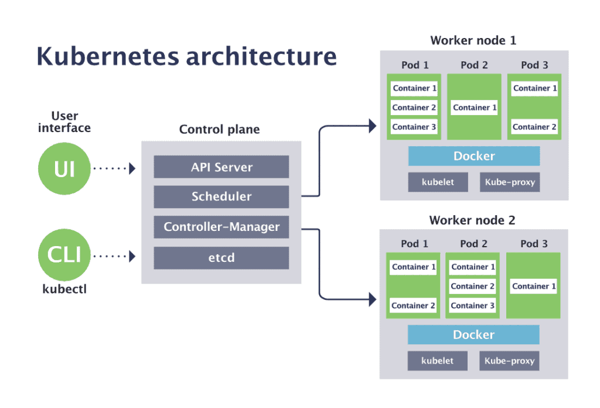

---
revealOptions:
  transition: fade

---

# Container mit kubernetes

<div id="header-footer">
  <p class="slide-footer"><br>Qvest Digital AG<br></p>
</div>

----

<div class="divided">
  <h4>Volker Schmitz</h4>
  
  <h5>DevOps Consultant</h5>
  <a href="mailto:v.schmitz@qvest-digital.com">v.schmitz@qvest-digital.com</a>
</div>

<div class="divided">
  <h4>Benjamin Jung</h4>
  
  <h5>DevOps Engineer</h5>
  <a href="b.jung@qvest-digital.com">b.jung@qvest-digital.com</a>
</div>

<!--div class="divided">
  <h4>Daniel Zerlett</h4>
  
  <h5>Software Architect</h5>
  d.zerlett@qvest-digital.com
</div-->

Note:
Wer seid Ihr/Vorstellungsrunde
Regeln:

- Du
- Fragen direkt mit aufzeigen
  - kein reinreden
- Diskusionen erwünscht

----

# Einführung in Kubernetes auf Basis von k3s

 - Schulung für grundlegende Kenntnisse über Kubernetes
 - Fokus auf Einführung in Kubernetes und wichtige Konzepte
 - Praktisches Beispiel: Bereitstellung von Gitea mit PostgreSQL in Kubernetes

----

## Inhaltsverzeichnis

- Was ist Kubernetes?
- Architektur von Kubernetes
- Architektur-Unterschiede zwischen k8s und k3s
- Einführung in die Kommandozeile: kubectl
- Basis Ressourcen &amp; grundlegende Konzepte
- Optional: Kubernetes StatefulSet
- Optional: Kubernetes DaemonSet
- Optional: Einblick in Kustomize
- Optional: Praktische Tools

---

## Was ist Kubernetes?

 - Orchestrierungssystem (nicht nur) für Container
 - Open Source
 - Verwaltung, Bereitstellung und Skalierung von Anwendungen
 - Deklarative Konfiguration
 - Einblick in die Kubernetes Distributionen
 - Erweiterbarkeit

----

### „Griechische Seefahrer“

<!-- .slide: data-background-opacity="10%" data-background-image="./images/backgrounds/choco-1920x1080.png" -->

  - Kubernetes ist das griechische Wort für „Steuermann“
  - Viele Kubernetes-nahe Projekte nutzen (z.T. griechische) Begriffe
    mit nautischem Ursprung
      - Istio (griechisch ιστίο = „Segel“)
      - Helm (Steuerrad),
      - Popeye (der Spinat-essende Seemann)
  - Die Abkürzung K8S
    - K(ubernete)S = K(8)S
    - K + 8 Buchstaben + N = Kubernetes

Notes:
- tiller

----

### Architektur von Kubernetes (K8S)

- Master-Knoten
- Worker-Knoten
- Kubernetes API-Server
- etcd
- Weitere Komponenten

----
### Kubernetes-Komponenten (Diagramm)

<div></div>

Quelle: [CNCF.io blog post](https://www.cncf.io/blog/2019/08/19/how-kubernetes-works/)

----

### Architektur-Unterschiede zu k3s

- (Opininated) Kubernetes ohne Bloat
- Aussprache: keez / keys (?)
- CRI: containerd, CNI: flannel
- SQlite statt etcd als backend storage
- Traefik als Ingress Controller

----

### k3s-Komponenten (Diagramm)

<div></div>

Quelle: [k3s Dokumentation](https://docs.k3s.io/architecture)

---

## kubectl

Unser Tool für den Hands-on Workshop

<div></div>

... und wer ist eigentlich <q cite="https://groups.google.com/g/kubernetes-sig-cli/c/M6t40JP6n0g/m/U6Snz-bsFQAJ">kube-cuttle</q>?

----

### kubectl - Funktionstests

```sh
kubectl version
```

<iframe src="http://localhost:4200?u=trainer&p=trainer"> <!-- .element: class="fragment" -->

Note:
  kubectl cluster-info ausführen und damit Funktionsweise von k3s überprüfen evtl.?

----

### Autocomplete für kubectl


<!-- .slide: data-background-opacity="20%" data-background-image="./images/backgrounds/magician-1920x1080.png" -->

- bash:
  ```bash
  echo "source <(kubectl completion bash)" >> ~/.bashrc
  ```
- zsh:
  ```zsh
  echo '[[ $commands[kubectl] ]]' \
  '&& source <(kubectl completion zsh)' >> ~/.zshrc
  ```
- fish:
  ```fish
  echo 'kubectl completion fish | source' >> ~/.config/fish/config.fish
  ```

Quelle: [kubernetes.io/docs](https://kubernetes.io/docs/reference/kubectl/cheatsheet/#kubectl-autocomplete)

----

### kubectl - Imperative/Dekalarative Nutzung

* Imperative Nutzung für einfache / schnelle Aufgaben
* Reproduzierbarkeit mit deklarativer API einfacher
* Hier nutzen wir *fast* ausschließlich die deklarative API

---

## Kubernetes Pods

<!-- .slide: data-background-opacity="20%" data-background-image="./images/backgrounds/dolphins.jpg" -->

<div></div>

**Was ist ein Pod?**

<q cite="https://www.sciencefocus.com/nature/whats-the-difference-between-a-shoal-a-school-and-a-pod">Pods are herds of marine mammals including whales, dolphins, walruses and seals.</q>

Quelle: [BBC Science Focus](https://www.sciencefocus.com/nature/whats-the-difference-between-a-shoal-a-school-and-a-pod)

----

### Kubernetes Pods - apply

Erstelle einen "gitea" Pod mit Hilfe der beigelegeten YAML Datei

```sh
kubectl apply -f ./examples/k3s/gitea/basic_pod.yaml
```

<iframe src="http://localhost:4200?u=trainer&p=trainer"> <!-- .element: class="fragment" -->

----

### Kubernetes Pods - describe


```sh
kubectl describe pods/gitea | less
```

<iframe src="http://localhost:4200?u=trainer&p=trainer"> <!-- .element: class="fragment" -->

----

### Kubernetes Pods - get

Schaue dir den erstellen Pod im Cluster an

```sh
kubectl get pods/gitea
```

<iframe src="http://localhost:4200?u=trainer&p=trainer"> <!-- .element: class="fragment" -->

Note:
  - Manifest Sections (meta/spec/status)
  - Vorstellung der Verschiedenen Outputs
    - YML/JSON/etc
  - Die Ablage im kubernetes ist immer JSON

----

### Kubernetes Pods - logs

Schaue dir die logs von Gitea an

```sh
kubectl logs pods/gitea
```

<iframe src="http://localhost:4200?u=trainer&p=trainer"> <!-- .element: class="fragment" -->

Wie funktioniert der "Follow Mode"?

----

### Kubernetes Pods - port-forward

Nutze port-forward, um einen HTTP-Request gegen den Pod abzusetzen

```sh
LOCAL_PORT=8080 # Setze diese Variable entsprechend Deinem Gusto. ;-)
kubectl port-forward pods/gitea ${LOCAL_PORT}:80
```

<iframe src="http://localhost:4200?u=trainer&p=trainer"> <!-- .element: class="fragment" -->

Note:
- nicht zu weit ausschweifen

----

### Hands-on

1. Nutze einen versionierten Tag oder HASH für das Image (nicht latest!)
1. Lösche den erstellten Pod wieder.
1. Starte eine Gitea mit PostgreSQL im selben Pod

Zusatzaufgabe:
1. Konfiguriere die Datenbank und Gitea mittels `spec.containers.*.env`

[Kubernetes Docs](https://kubernetes.io/)

----

### Hands-on

<iframe src="http://localhost:4200?u=trainer&p=trainer"> <!-- .element: class="fragment" -->

----

### Kubernetes Pods - Zusammenfassung

- Einblick in kubernetes YAML files
- Pod Verwaltung
- Pod Environment
- Grundlagen `kubectl`
  - apply / delete
  - describe
  - logs

---

## Kubernetes Labels &amp; Annotations

- Wozu sind Labels und Annotations gut?
- Wie erstellt man Labels?

----

## Hands-on

- Schaue Dir die Labels von Gitea an
  - `kubectl get pods --show-labels`
- Lass Dir Pods anhand von ausgesuchten Labels anzeigen
  - `kubectl get pods -l <...>`

<iframe src="http://localhost:4200?u=trainer&p=trainer"> <!-- .element: class="fragment" -->

Note:
  - annotations

----

### Standard-Labels

* `app.kubernetes.io/name`
* `app.kubernetes.io/instance`
* `app.kubernetes.io/version`
* `app.kubernetes.io/component`
* `app.kubernetes.io/part-of`
* `app.kubernetes.io/managed-by`

Quelle: [Kubernetes Dokumentation](https://kubernetes.io/docs/concepts/overview/working-with-objects/common-labels/)

----

### Standard-Labels: Beispiel

```yaml
# This is an excerpt
metadata:
  labels:
    app.kubernetes.io/name: mysql
    app.kubernetes.io/instance: mysql-abcxzy
    app.kubernetes.io/version: "5.7.21" # <-- achtung!
    app.kubernetes.io/component: database
    app.kubernetes.io/part-of: wordpress
    app.kubernetes.io/managed-by: helm
```

---

## Kubernetes Ressourcen

*Was sind Kubernetes-Ressourcen?*

<q cite="https://kubernetes.io/docs/concepts/extend-kubernetes/api-extension/custom-resources/">A resource is an endpoint in the Kubernetes API that stores a collection of API objects of a certain kind; for example, the built-in pods resource contains a collection of Pod objects.</q>

Quelle: [Kubernetes Dokumentation](https://kubernetes.io/docs/concepts/extend-kubernetes/api-extension/custom-resources/)

----

### Ablage von Kubernetes-Ressourcen

- JSON-Objekte mit 3 oder 4 Keys zur eindeutigen Identifikation:
  - `apiVersion` ([API + "/"] + Version)
  - `kind`
  - `spec.name`
  - `spec.namespace`
- Auch wenn meistens YAML-Dateien editiert werden, wird doch immer JSON gespeichert

Note:
- Darauf hinweisen, dass alle YAML-spezifischen Features wie Kommentare, Anchors, etc.
  einfach wegfliegen.

----

### Built-in: Basis-Ressoucen (v1)

* `apiVersion: v1` (manchmal auch "core" genannt)
* Kubernetes "v1"-Versprechen der vollständigen Abwärtskompatibilität

### Built-in: Basis-Ressourcen (non-v1)

Beispiele:

 * Ingress API (`networking.k8s.io/v1/Ingress`)
 * Horizontal Pod Autoscaling (`autoscaling/v2/HorizontalPodAutoscaler`)

----

### Custom Resources

Kubernetes kann mit Hilfe von `Custom Resource Definitions` erweitert
werden. (nicht im Scope des Teils des heutigen Workshops)

---

## Kubernetes Services

<div></div>

**Was ist ein Service?**

* DNS &amp; Cluster-internes Load balancing
* Services ermöglichen Pods den Zugriff auf andere Pods

----

### Hands-on

Erstelle einen Separaten MariaDB Pod mit einem vorgeschalteten Service

```sh
kubectl apply -f ./basic_mariadb_service.yaml
```

- Schaue Dir Service und Pod mit kubectl describe an
- Nutze kubectl port-forward, um den Pod über den Service anzusprechen
- Verbinde Gitea mit dem separaten PostreSQL Pod

**ACHTUNG**: Port-forwarding funktioniert in der Praxis nicht so, wie man es erwartet!

----

### Hands-on

<iframe src="http://localhost:4200?u=trainer&p=trainer"> <!-- .element: class="fragment" -->

----
### Hands-on

- Was ist der Unterschied zwischen den verschiedenen Service-Typen?
- Wozu dienen die Selektoren der Services?
- Was passiert, wenn zwei Services die gleichen Pods selektieren?
- Was passiert, wenn ein Service unterschiedliche Pods selektiert?
- Wie kann man überprüfen, welche Pods ein Service selektiert?
- Wie können Pods mit Hilfe von Services miteinander kommunizieren?

---

## Kubernetes ConfigMaps


**Was ist eine ConfigMap?**

* Key-value storage
* Stellen Umgebungsvariablen oder Dateien für Pods zur Verfügung

----

### Anlegen einer ConfigMap

```sh
kubectl apply -f examples/k3s/gitea/configmap.yml

```

Note:
  - Ziel: Konfiguriere Database mit PW als Secret

### Hands-on

1. Konfiguriere Gitea so, dass es beim Start direkt die PostgreSQL Datenbank nutzt.
1. Erweitere daf&uuml;r die erstellte Configmaps.

[Gitea Docs](https://docs.gitea.com/)

----

### Hands-on

<iframe src="http://localhost:4200?u=trainer&p=trainer"> <!-- .element: class="fragment" -->

----

### Kubernetes ConfigMaps - Änderungen

* ConfigMaps *können* als "`immutable`* markiert werden
  (seit Kubernetes 1.21 ist das ein stabiles Feature, also relativ neu)
* Wie erfahren Pods, dass sich referenzierte ConfigMaps geändert haben?
  - `envFrom`: Änderungen werden nicht propagiert
  - `volumeMount`: Änderungen werden nur propagiert, wenn kein `subPath` verwendet wird

----

### Kubernetes ConfigMaps - Zusammenfassung

* ConfigMaps sind Key-value stores
* Gut für: die Ablage von Umgebungsvariablen (.env File)
* Gut für: Konfigurationsdateien
* ConfigMaps können als `immutable` markiert werden
* Versionierung kann über Suffixes (z.B. Hashes des Inhalts o.Ä.) erfolgen
* Vorsicht mit Werten, die in JSON/YAML kein String sind!

---

## Kubernetes Secrets

<div></div>

**Was ist ein Secret?**

----

### Kubernetes Secrets - base64-Daten

```yaml
apiVersion: v1
kind: Secret
metadata:
  name: my-secret
data:
  password1: cGFzc3dvcmQ= # "secret"
  password2: c2VjcmV0     # "password"
```

----

### Kubernetes Secrets - Anlegen eines Secrets

```sh
kubectl apply -f ./examples/k3s/gitea/basic_secret.yaml
```

<iframe src="http://localhost:4200?u=trainer&p=trainer"> <!-- .element: class="fragment" -->

----

### Kubernetes Secrets - Typen

* `Opaque` (am häufigsten verwendet)
* `kubernetes.io/tls`
* `kubernetes.io/ssh-auth`
* `kubernetes.io/basic-auth`
* ...

Ein leerer `spec.type` ist gleichbedeutend mit `spec.type=Opaque`

Quelle: [Kubernetes Dokumentation](https://kubernetes.io/docs/concepts/configuration/secret/)

Notes:
- Neue types können durch AdmissionControls in Form einer
  ValidatingWebhookConfiguration realisiert werden.

----

### Kubernetes Secrets - stringData

Vereinfachtes Anlegen von Secrets mit einer "write only" Property:

```yaml
apiVersion: v1
kind: Secret
metadata:
  name: test-secret-1
stringData:
  foo: bar
  bar: |
    Ein etwas längerer Wert mit viel Text
    und so ....
```

----

### Kubernetes Secrets - Zugriff per API

* Shell scripting mit `kubectl`, `jq` und `base64`

<iframe src="http://localhost:4200?u=trainer&p=trainer"> <!-- .element: class="fragment" -->

Notes:
- verschieden Möglichkeite zeigen, wie Daten ausgelesen werden können.
- | jq ... | base64
- -o go-template='{{ .data.??? }}' ...
- -o jsonpath='{.data.???}'
- ...

----

### Kubernetes Secrets - Zusammenfassung

* Secrets funktionieren im Wesentichen wie ConfigMaps
* Secrets haben einen Typen (default: `Opaque`)
* Secrets *können* (wie ConfigMaps) als "`immutable`" markiert werden
* Die Values eines Secrets sind base64 encoded

---

## Kubernetes Persistence

<div>
  
  
</div>

PersistenceVolumes &amp; PersistentVolumeClaims

----

### Persistence Volumes

- Der Storage in Pods ist grundsätzlich "ephemeral" (*kurzlebig*)
  - Restart oder Crash führen zu einem Verlust der Daten

Um dies zu verhindern gibt es verschiedene Storage Provider

- [Built-in Types by K8S](https://kubernetes.io/docs/concepts/storage/volumes/)
- Erweiterbar über Plugins

----

### LocalStorageProvider in k3s

Ein `PersitentVolumeClaim` ist ein User-spezifischer "Storage Request",
der dazu dient Storage über das jeweilig Plugin zu beanspruchen.

----

### Hands-on

```shell
kubectl apply -f basic_pvc.yaml
kubectl apply -f basic_pvc_pod.yaml
kubectl get pv
kubectl pvc
```

<iframe src="http://localhost:4200?u=trainer&p=trainer"> <!-- .element: class="fragment" -->

----

### Hands-on

- Sorge dafür das deine Datenbank &amp; Gitea ihre Daten persistieren.
- Nutze hierzu die `local-path` (default) StorageClass von k3s.

----

## Kubernetes Deployments & ReplicaSets

<div>
  
  
</div>

Notes:
  - replicaset

----

### Was ist ein ReplicaSet?

<q cite="">A ReplicaSet's purpose is to maintain a stable set of replica Pods running at any given time. As such, it is often used to guarantee the availability of a specified number of identical Pods.</q>

Quelle: [Kubernetes Dokumentation](https://kubernetes.io/docs/concepts/workloads/controllers/replicaset/)

----

### Verwendung eines ReplicaSets

<q cite="https://kubernetes.io/docs/concepts/workloads/controllers/replicaset/#when-to-use-a-replicaset">A ReplicaSet ensures that a specified number of pod replicas are running at any given time. However, a Deployment is a higher-level concept that manages ReplicaSets and provides declarative updates to Pods along with a lot of other useful features. Therefore, we recommend using Deployments instead of directly using ReplicaSets, unless you require custom update orchestration or don't require updates at all.</q>

Quelle: [Kubernetes Dokumentation](https://kubernetes.io/docs/concepts/workloads/controllers/replicaset/#when-to-use-a-replicaset)

----

### Was ist ein Deployment?

<q cite="https://kubernetes.io/docs/concepts/workloads/controllers/deployment/">
A Deployment provides declarative updates for Pods and ReplicaSets.</q>

Quelle: [Kubernetes Dokumentation](https://kubernetes.io/docs/concepts/workloads/controllers/deployment/)

----

### Hands-on

Erstelle ein Gitea-Server Deployment

```sh
kubectl apply -f ./ext_gitea_server_deployment.yaml
```

- Schaue Dir das Deployment mit `kubectl get` an
- Was fällt Dir bezüglich der Labels auf?
- Ändere den Wert von `spec.replicas`. Was passiert?

---

## Kubernetes Namespaces

- Kubernetes verwendet Namespaces, um Ressourcen innerhalb eines Clusters zu isolieren.
- Die Namen von Ressourcen müssen innerhalb eines Namespaces eindeutig sein, aber nicht über Namespaces hinweg.
- Die Namespace-basierte Begrenzung gilt nur für namespaced Objekte
  - (z.B. Deployments, Services)
  - nicht für cluster-weite Objekte (z.B. StorageClass, Nodes, PersistentVolumes).
  - ein Namespace selbst ist ein cluster-weites Objekt.

----

### Kubernetes Namespaces

```sh
kubectl get namespace
kubectl namespace create gitea
```

<iframe src="http://localhost:4200?u=trainer&p=trainer"> <!-- .element: class="fragment" -->

Note:
- "Cluster im Cluster"
- Viele Möglichkeiten:
  - Ein Namespace pro fachlicher Domäne
  - Ein Namespace pro Team
  - Ein Namespace pro Service
  - ...

----

### Kubernetes Namespaces - Defaults

- default
- kube-node-lease
- kube-public
- kube-system

([Kubernetes Dokumentation](https://kubernetes.io/docs/concepts/overview/working-with-objects/namespaces/#initial-namespaces))

----

### Hands-on

Welchen Namespace nutzt du?

```shell
kubectl config view --minify | less
```

<iframe src="http://localhost:4200?u=trainer&p=trainer"> <!-- .element: class="fragment" -->

----

### Kubernetss Namespaces Hands-On

- Verschiebe deine Gitea Application in den Namespace SVC.
- Entferne deine vorhereige Application
  - in welchem Namespace befand sie sich?
- Benutze den `namespace` Parameter im Manifest.

---

## Kubernetes Intermezzo

### K8S-Abkürzungen

- Pod: po
- Service: svc
- ConfigMap: cm
- Namespace: ns
- PersistentVolume: pvc
- [...]

----

### Hands-on

<iframe src="http://localhost:4200?u=trainer&p=trainer"> <!-- .element: class="fragment" -->

---

## Fragen

Notes:
- wir haben bisher nur an der Oberfläche gekratzt
- Nächste Punkte:
  - Resource Limits
  - Container ohne root-Rechte
  - read-only containers, z.B. mit emptyDir

----

## Optional: Kubernetes StatefulSet

----

## Optional: Kubernetes DaemonSet

----

## Optional: Vertiefung PersitentVolumes & Claims

----

## Optional: Einblick in Kustomize

----

## Optional: Praktische Tools

 - [k9s](https://k9scli.io/)
 - [kubectx / kubens](https://github.com/ahmetb/kubectx)
 - [popeye](https://github.com/derailed/popeye)


---

## Ausblick

- Lifecycle und Lifecycle Management
- Kubernetes Hardening
- Kubernetes LoadBalancing
- Controller / Operator
  - CustomResources
- Kubernetes unter der Haube

---

## Ende
